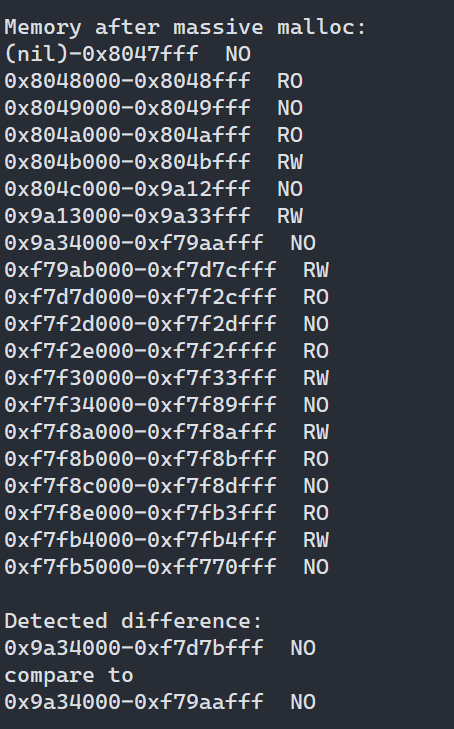

<h3 align="center">CMPUT 379</h3>
<h2 align="center">Assignment 1, Winter 2021</h2>
<h3 align="center">Danh Nguyen</h3>
___
<h4>1. Introduction</h4>

Remote repository can be found <a href="https://github.com/danny-cpp/assign1_OS">here</a>.

    Program is used to scan the memory of a 32-bit process <code>(0x0 to 0xffffffff)</code>.
    It works by acting on the memory pages and handle the signal responded by the system.
    Then, it collectively group adjacent pages with the same access as a region.
    There are 3 permission: No access (MEM_NO), read-only (MEM_RO), read+write (MEM_RW).

    A successful scan will have the memmory layout before and after compared. The first
    memregion instance where they differ will be reported, else, no difference will be
    reported.

<h4>2. Instruction</h4>

    Program must be compile as 32-bit. All compilation are prepared in Makefile. Custom page size
    can be configured by <code>CFLAG</code>. If no input, page size is defaulted to 4096KB. 
    To create all executables, use:

<code>make <(optional)|mem_1|mem_2|mem_3> <"CFLAGS=-DUSER_PAGE_SIZE=(optional)"></code>

    To clean targets and objects:

<code>make clean</code>

    Specific target instruction.

<ul>
    <li><code>mem_2</code> executable accept a 2nd argument as input.
    It reads a file and load it to memory via <code>mmap()</code>. If
    no input is entered, it defaults to the provided <i>Tags.json</i> file.</li> 
</ul>

<h4>3. Description</h4>

    Each executable achieve memory alteration via different methods. In-depth description
    is provided within the code itself.

<ul>
    <li><code>mem_1</code>Heap memory allocation. A part of memory once was no-accessible 
    becomes available for read and write af ter allocation (and initialization).</li>
    <li><code>mem_2</code>Dynamic loading. This is when a function is loaded "lazily".
    Until the function is used, it will not load into memory; then will be free immediately
    after used. This offers high memory efficiency. By capture the memory layout before free-up,
    we can see how the memory alters.</li>
    <li><code>mem_3</code>Memory mapping. By transfer a whole file onto memory, we can take
    advantage of the DRAM speed. Memory layout will be different before and after the mmaping.</li>
</ul>

<h4>4. Acknowledgement</h4>

    Code uses materials of TAs and courses materials, references from the internet. Citation are inlcuded
    in the code.

___ 
Danh Nguyen 
Winter 2021, University of Alberta 
All rights reserved